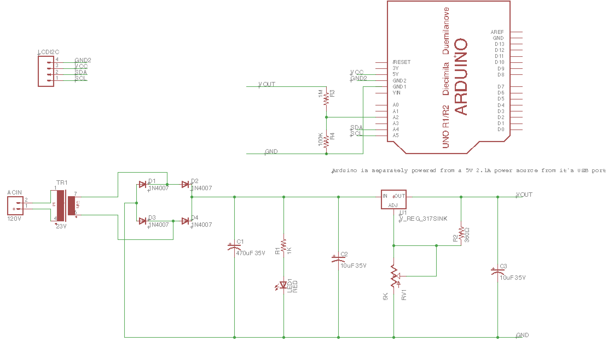

# Optimus

COMPONENTS LIST 

1. LM317 through-hole version 
2. 4 1N4007 diodes (1A) 
3. 1  470uF 35V electrolytic capacitor 
4. 2  10uF  35V electrolytic capacitors
5. 360 Ohm resistor 1% tolerance
6. 5k potentiometer
7. 1K resistor 1% tolerance 
8.  Red 5mm LED
9. I2C 16X2 character LCD
10. 23 V transformer 
11. Adafruit Perma-Proto Half-sized Breadboard PCB
12. BNC T-Connector
13. BNC Male Plug to Dual Hook Clip Oscilloscope Test Leads Coaxial Cable
14. Different colored 22 AWG stranded core wire
15. Male to Female jumper wires 
16. Female to Female jumper wires

